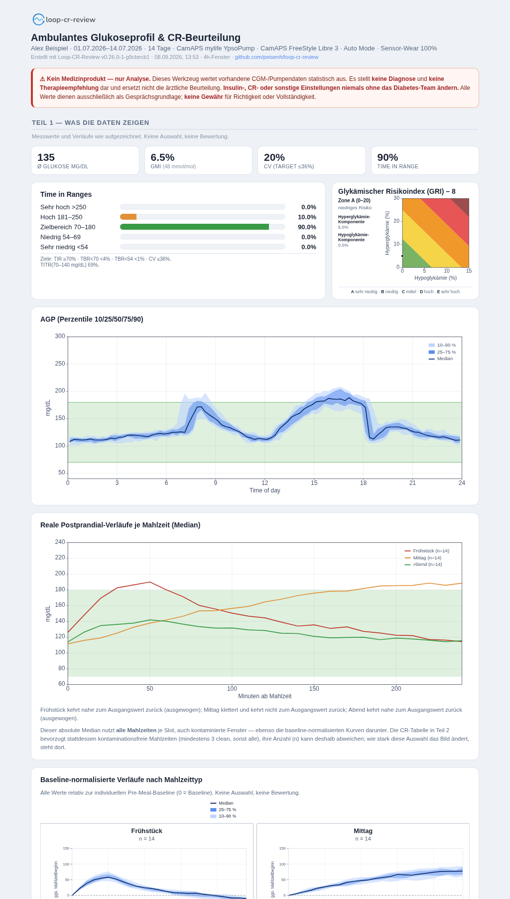

# loop-cr-review

**Loop-aware Carb-Ratio Review** — CR-Beurteilung aus realen CamAPS-FX-Daten.

Wertet einen CamAPS/Glooko-Export aus und erzeugt einen eigenständigen HTML-Report mit Ambulatory Glucose Profile (AGP), Konsens-Metriken und einer **Loop-aware Beurteilung der Kohlenhydrat-Verhältnisse (CR)** pro Tageszeit-Slot.



*Beispiel-Report mit synthetischen Demo-Daten ([vollständiger Report](docs/screenshot_full.png)).*

---

## ⚠️ Wichtiger Hinweis — bitte zuerst lesen

> **Dies ist kein Medizinprodukt und dient ausschließlich der Analyse.**
>
> - Das Tool **stellt keine Diagnose** und **keine Therapieempfehlung**. Es wertet lediglich bereits vorhandene CGM- und Pumpendaten statistisch aus.
> - Die Ergebnisse sind **ausschließlich als Gesprächsgrundlage für das Diabetes-Team** gedacht.
> - **Ändere Insulin-, CR-, Korrektur- oder sonstige Therapieeinstellungen niemals ohne Rücksprache und Freigabe durch das behandelnde Diabetes-Team.**
> - Es besteht **keine Gewähr** für Richtigkeit, Vollständigkeit oder Eignung für einen bestimmten Zweck. Nutzung auf eigene Verantwortung.
> - Unter Hybrid-Closed-Loop (CamAPS FX Auto Mode) sind die Auswertungen durch die laufende Loop-Kompensation und die Algorithmus-Adaption **konfundiert** — sie sind Indizien, keine Beweise.

---

## Was es macht

- **AGP** (Perzentile 5/25/50/75/95 über 24 h) und **mediane Postprandial-Verläufe** je Slot.
- **Konsens-Metriken** (Battelino 2019): Ø-Glukose, GMI, CV, TIR/TITR/TBR/TAR, Sensor-Wear.
- **Loop-aware CR-Beurteilung** pro Slot (Frühstück / Mittag / Abend) mit datengetriebenem Befund (zu schwach / zu stark / passend) und Per-Mahlzeit-Detailtabelle.
- **Ableitungen aus der Kurvenform**: pro Slot Kurven-Metriken (Peak-Höhe/-Zeit, Tiefpunkt, Spätanstieg) und daraus abgeleitete Kandidaten-Stellschrauben (SEA/Spritz-Ess-Abstand, Dosis, Fett/Protein, Hypo-Achtung) — als Hypothesen fürs Team, plus Klarstellung von `CR_eff` als Ansatz statt Zielwert.
- Alles Patientenbezogene (Name, Gerät, Zeitraum, Interpretation) wird **aus den Daten** gezogen, nichts ist hartcodiert.

## Kontext: CamAPS FX & Glooko

**CamAPS FX** ist eine App (CamDiab), die den Cambridge-Hybrid-Closed-Loop-Algorithmus (MPC) umsetzt. Sie **moduliert die Basalinsulin-Abgabe** laufend (erhöhen / senken / aussetzen, ca. alle 8–12 min), um den Glukosewert im Zielbereich zu halten; **Mahlzeitenboli** gibt die nutzende Person selbst an, berechnet über das Kohlenhydrat-Verhältnis (CR). Kombiniert wird sie mit CGM-Sensoren (z. B. FreeStyle Libre 3, Dexcom) und kompatiblen Pumpen (z. B. YpsoPump). „Auto Mode" bezeichnet den geschlossenen Regelkreis.

**Glooko** ist eine Diabetes-Datenplattform. CamAPS lädt CGM-, Bolus- und Basaldaten dorthin hoch; von dort exportiert man ein Daten-ZIP mit den CSV-Dateien, die dieses Tool einliest.

**Datenfluss:** CamAPS FX (Auto Mode) → Glooko → CSV-Export (ZIP) → `loop-cr-review` → HTML-Report. Mit „Glooko/CamAPS-Export" ist also die aus Glooko heruntergeladene ZIP-Datei mit CamAPS-Daten gemeint.

## ⚠️ Unterstützte Systeme — nur CamAPS FX

> **Dieses Tool ist ausschließlich für CamAPS FX (Auto Mode) entwickelt und getestet.**

Die Kernmethode setzt darauf, dass CamAPS Auto-Korrekturen als **moduliertes Basal** liefert. Das Loop-Mehrbasal im Mahlzeitfenster ist damit das Signal für eine zu schwache/starke CR. Andere Systeme funktionieren anders:

- **Tandem Control-IQ, Omnipod 5 u. a.** geben Auto-Korrekturen teils als **Boli** ab. Diese tauchen dann nicht im Basal auf → das Loop-Mehrbasal unterschätzt die Kompensation, der Befund wird verfälscht.
- **AndroidAPS, Loop/Trio** haben eigene Export-/Datenstrukturen (z. B. Nightscout statt Glooko).

Für andere Loops ist eine Nutzung **mit Anpassungen denkbar**, aber nicht getestet — insbesondere müssten (1) die Export-Spalten gemappt und (2) Auto-Korrektur-**Boli** in den „Loop-Mehrbasal"-Term einbezogen werden. Ohne diese Anpassungen sind die Ergebnisse für Nicht-CamAPS-Systeme nicht gültig.

## Die zentrale Idee

Unter CamAPS FX Auto Mode korrigiert der Algorithmus eine zu schwache CR über **erhöhtes Basal**. Der Blutzucker kehrt dann trotzdem zur Baseline zurück — der klassische Postprandial-Return-Test *übersieht* die zu schwache CR. Das eigentliche Signal ist deshalb **nicht** die Glukosekurve, sondern das vom Loop im Mahlzeitfenster zusätzlich gelieferte Basal:

```
Loop-Mehrbasal   = ∫ (Basalrate − Fasten-Basal) dt   über das Fenster nach der Mahlzeit
CR_eff           = CHO / (Mahlzeitbolus + Loop-Mehrbasal)
```

Positives Loop-Mehrbasal ⇒ der Loop gleicht eine zu schwache CR aus ⇒ `CR_eff` ist straffer als die abgeleitete CR. Der Return Δ dient nur noch als Bestätigung.

## Installation

Debian/Ubuntu über Systempakete (empfohlen, z. B. im Homelab):

```bash
sudo apt install python3-numpy python3-matplotlib python3-jinja2
```

Oder plattformunabhängig über pip (ggf. in einem venv):

```bash
pip install -r requirements.txt
```

### Fertige Binaries (ohne Python)

Für jedes Release werden über GitHub Actions eigenständige Executables gebaut und angehängt
(`loop-cr-review-linux`, `loop-cr-review-windows.exe`) — herunterladen, ausführbar machen, fertig.
Das Report-Template ist im Binary enthalten.

Selbst bauen (auf der jeweiligen Plattform, kein Cross-Compile):

```bash
pip install -r requirements.txt pyinstaller
pyinstaller --onefile --name loop-cr-review \
  --add-data "templates/report.html.j2:templates" loop_cr_review.py   # Windows: ";" statt ":"
```

## Nutzung

```bash
# Glooko-Export entpacken, dann:
python3 loop_cr_review.py <export_ordner>            # Default: 4-h-Fenster
python3 loop_cr_review.py <export_ordner> -w 3.5     # anderes Fenster (Stunden)
python3 loop_cr_review.py <export_ordner> -o report.html
python3 loop_cr_review.py <export_ordner> -t <template_ordner>
```

| Option | Bedeutung | Default |
| --- | --- | --- |
| `export_dir` | entpackter Glooko/CamAPS-Export | `.` |
| `-w, --window-hours` | postprandiales Auswertungsfenster (h) | `4.0` |
| `-o, --out` | Ausgabe-HTML | `<name>_loop-cr-review_<fenster>.html` |
| `-t, --template-dir` | Ordner mit `report.html.j2` | `./templates` |

**PDF:** Report im Browser öffnen → Drucken → „Als PDF speichern" (Karten sind gegen Seitenumbrüche geschützt).

## Beispieldaten zum Ausprobieren

Im Ordner [`example-data/`](example-data/) liegt ein vollständiger, **rein synthetischer**
Beispiel-Export (Patient „Alex Beispiel", 14 Tage, CamAPS FX / Libre 3 / YpsoPump) — keine echten
Patientendaten. Damit lässt sich das Tool ohne eigenen Export testen:

```bash
python3 loop_cr_review.py example-data
```

Der erzeugte Report entspricht dem Screenshot oben.

Eigene Exporte legst du am besten unter [`data/`](data/) ab — der Inhalt dieses Ordners ist per
`.gitignore` ausgenommen, damit echte Patientendaten nicht ins Repo geraten:

```bash
python3 loop_cr_review.py data/mein-export
```

## Erwartete Eingabe

Ein entpackter **Glooko-Export mit CamAPS-FX-Daten** (siehe „Kontext" oben) mit:

- `cgm_data_*.csv` — CGM-Werte (`Zeitstempel, Glukose (mg/dl), Seriennummer`); Glooko splittet lange Zeiträume auf mehrere nummerierte Dateien (`cgm_data_1.csv`, `cgm_data_2.csv`, …) — alle werden eingelesen
- `Insulin data/bolus_data_*.csv` — Boli inkl. `Kohlenhydrataufnahme (g)` und `Abgegebenes Insulin (E)`
- `Insulin data/basal_data_*.csv` — Basal-Segmente (`Rate`, `Dauer`)

Deutsches Zahlformat (Komma) und `dd.mm.yyyy HH:MM` werden erkannt. Einheit: **mg/dL**.

## Projektstruktur

```
loop-cr-review/
├── loop_cr_review.py          # Logik (Einlesen, Analyse, Charts, Context)
├── templates/
│   └── report.html.j2         # Darstellung (Jinja2) — Layout/Wording hier anpassen
├── example-data/              # synthetischer Beispiel-Export zum Ausprobieren
├── data/                      # eigene Exporte (Inhalt per .gitignore ausgenommen)
├── docs/                      # Screenshots fürs README
├── requirements.txt
├── README.md
├── CONTRIBUTING.md
├── LICENSE
└── .pylintrc
```

## Methoden-Parameter (datenunabhängig)

Als benannte Konstanten oben in `loop_cr_review.py` gebündelt und anpassbar: Slot-Zeitfenster, Mahlzeit-Mindest-CHO, Merge-Fenster, Fasten-Fenster, Loop-Ratio- und Δ-Schwellen, CR-Abweichungs- und prä-BZ-Schwellen. Die klinischen Zielbereiche (TIR 70–180 usw.) folgen dem internationalen Konsens.

## Grenzen

- Gültig für **angesagte Mahlzeiten**; Confounder (Fett/Protein, Bewegung, Pre-Bolus-Timing, gesplittete/überlappende Boli) sind über Mediane gedämpft, nicht eliminiert.
- Das **Fasten-Basal** als Referenz setzt mahlzeit-/korrekturfreie Nächte (00–05 h) voraus.
- Die aus `CHO/Bolus` abgeleitete CR kann vom Bolusrechner beigemischte Korrekturen enthalten (das Tool weist darauf hin, wenn ein Slot auffällig abweicht).
- CamAPS' Adaption über Tage kann länger bestehende Fehleinstellungen teilweise glätten.

## Mitwirken

Beiträge sind willkommen. Das Projekt nutzt einen **DCO-Sign-off** (`git commit -s`); Details im bilingualen [`CONTRIBUTING.md`](CONTRIBUTING.md).

## Lizenz

**GNU Affero General Public License v3.0 or later (AGPL-3.0-or-later)** — siehe [`LICENSE`](LICENSE). Jede Quelldatei trägt einen `SPDX-License-Identifier`.

Copyright © 2026 Peter Eisenhauer &lt;github@peter-e.de&gt;

---

*Nochmals: kein Medizinprodukt, keine Therapieempfehlung, keine Gewähr. Änderungen an der Therapie ausschließlich durch das behandelnde Diabetes-Team.*
